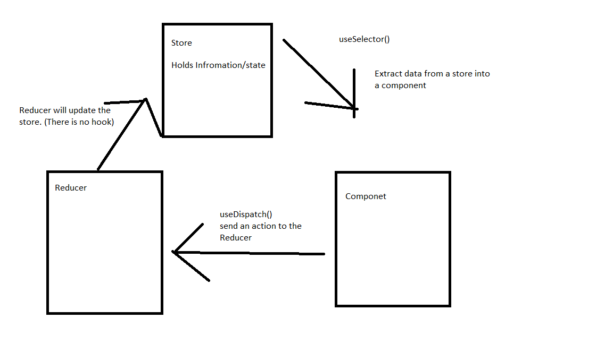

# Week 4 Review

## React
- Front-end JS/TS framework 
- Created by Facebook
- **Virtual DOM**
    - Under the hood how React works
    - Creating, updating garbage collecting JS objects is really fast for a browser to process
    - Constantly re-rendering and directly ediing nodes on the DOM is *not* efficient for a browser to perform
    - React has a virual dom consisting of JS objects that it tracks
        - It uses the virtual DOM to make **surgical** efficient updates to the real DOM
- **Single Page Application**
    - The entire website is all on one html page
    - JS is used to update and edit the single page
- Architecture of React
    - **Components**
        - Core building blocks of a React web page
        - Modular chunks of HTML/CSS/JS
        - Written in **JSX**
        - Two Varities
            - Class based
            - Function Based
                - Newer
                - *Preferrable* - Adam's opinion
    - **JSX**
        - JavaScript Extension
        - Hybrid language of HTML/CSS/JS
        - React philosophy is that these language *should* blend together
    - React does not enforce a specific style or organization when building an application
        - for better or for worse
    - A React application is essentially a Gigantic function composed of many smaller functions
- Component Anatomy
    - **props**
        - An object that holds variables passed in from the parent
    - **hooks**
        - functions that *hook* into the component to give it extra abilities
```JSX

// a component must start with a capital letter
export default function EmployeeRow(props){ // it can take in props to which can be used in the component

// must return a single root JSX tag
    return(<>
    </>)

}
```
- React Design Philosophy
    - Write as many *pure* and *stateless* components as possible
        - Components that do not have an internal state
        - They can take in props but there is no value being updated within them
    - Data only flows *down* in a react application
        - From parent to child via props
        - The only way for a child to update a parent is to pass *down* a setter function as props
        - **Display**
            - Statless components that are designed to look nice and display something
        - **Container**
            - stateful components that will pass data into display components
    - State in React is immutable
        - You have to replace rather than update stateful values
        - Derived from a functional perspective that a pure function has no side-effects and thus no mutability

## Hooks

### In Built React Hooks
- useState()
    - Creates a stateful encapsulated value within a component
    - returns and array with 2 values in it
        1. A read only variable
        2. Setter function that will update that variable and re-render the component
```JSX
const [employee,setEmployee] = useState()
```
- useRef()
    - create a constant reference to an HTML element
    - Primary use case is to get information out of inputs
```JSX
const nameInput = useRef()
```
- useEffect()
    - Gets its name from the term **side Effect**
        - Programming term for code that mutates values or edit information from Outside of a function
    - useEffect allows you to execute a callback function at given points in the component lifecycle
```JSX
useEffect(()=>{},[]) // execute the callback function ONCE when the component is first loaded
useEffect(()=>{})// execute anytime a stateful value changes
useEffect(()=>{},[somethinStaeful])// execute only when that specic state changes
useEffect(()=>{
    return ()=>{
        // yet another callback
    }
})// execute the returned callback when the component is destroyed
```
- useContext()
    - Allows a component to access a context object
    - Can be helpful for retrieving values from a parent component *without* having to use props
```JSX
const guestContext = createContext({fname:"Adam",lname:"Ranieri"})

export default function GuestInfo(){
    const guest = useContext(guestContext)
    guest.fname
}
```

## Redux
- Third party library for state management in React
- Redux vs Redux Toolkit
    - Redux original library and core code
    - Redux Toolkit is a developer friendly software package
        - Has a nice API and helpful methods
        - More specifically designed to work well with React

- Redux design pattern

- Data only flows in one way
- This data flow is circular
- Key Terms
    - **Store**
        - An encapsulated state to be used by your application
    - **Reducers**
        - Functions that can edit/update the state/store
    - **useSelector**
        - A hook that allows you to retrieve informaton from the store
    - **useDispatch**
        - A hook that allows you to send an action to a reducer
    - **Action**
        - A Object that has a these two properties {type:"Groceries/addProduct", payload:"Eggs"}
            - payload is optional

## React Router v6
- One library for performing routing in React
- Key Components
    - BrowserRouter
        - All routes go inside the BrowserRouter
    - Route
        - Defines a path along with the element to connect to
    - Routes
        - Defines a group of routes
    - Link
        - Equivalent to an anchor tag


