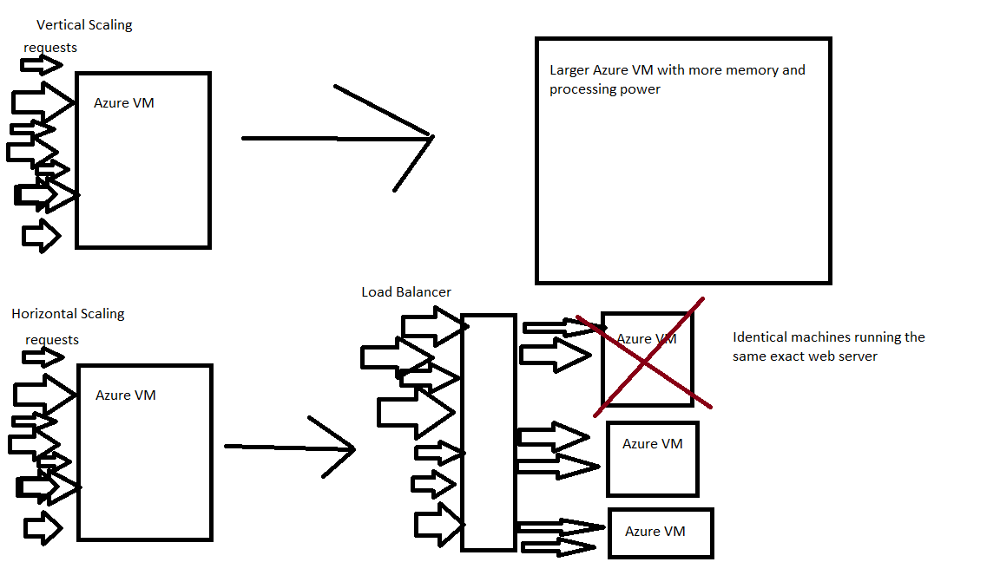

# Week 7 Review

## React Native
# Essential Terminology
- Native
    - inherent to the device the code is running on.
        - example: Java code in Android OS for operating the camera
- Native Module
    - Code written in Java/C/Swift/etc that directly interacts with the native phone APIS.
- JSI
    - JavaScript Interface
    - Allows JavaScript methods to directly use methods/objects in a Native Module

# Essential Components
- Core Components provided by react Native
- Will be turned into Native versions on phone or other device

|Component|HTML Equivalent|Usage|
|---------|---------------|-----|
|View| div| a rectangular pactch of screen|
|Text| p, h1-h6, b | Any text that needs to be displayed|
|Image| img| display an image|
|ScrollView| div | A scrollable view|
|TextInput| input type="text"| allows for text input|
|FlatList| ul | Simple List of rendered views|
|SectionList| dl | List of rendered views with a title for each item|
|Button| button| button for handling presses|
|Pressable| N/A| Wrapper for other components to add press functionality (Replaces Touchable Opacity)|
|Switch| input type="checkbox"| Boolean value input|
|StatusBar| N/A | Shows Celluar, battery etc...|

# React Native APIs
- React Native provides APIs for common operations on a phone
- These APIs are accessible by your React Native Code
    - Avaialable as imports from react-native

|API|Usage|
|---|-----|
|Animated| Performs smooth animations|
|Platform| Used to get the OS the code is running on like Android, web or IOS|
|Vibration| Virbate the phone|
|useWindowDimension| API in the form of a hook that allows getting screen size|
|StyleSheet| Used to write styles in a CSS-esque syntax|
- Many more not listed

# Styling
- True CSS does not exist in React Native
    - CSS is for a web browser not phone
- Using the StyleSheet API you can create CSS-esque styling using object-literals in code
- The core method of styling is flexbox

| Property      | Values          | Description                                         |
| ------------- | --------------- | --------------------------------------------------- |
| flexDirection | 'column', 'row' | Used to specify if elements will be aligned vertically or horizontally |
| justifyContent| 'center','flex-start','flex-end','space-around','space-between'| Used to determine how should elements be distributed inside the container |
| alignItems    | 'center','flex-start','flex-end','stretched' | Used to determine how should elements be distributed inside the container along the secondary axis (opposite of flexDirection) |

# SQL
- **Structured Query language**
    - The scripting language used for **RDBMS**
- **RDBMS**
    - Relational Database Managament System
        - Postgres
        - MySQL
        - MariaDB
- Relational Database
    - Stores infromation in tables
    - These Tables are often **normalized** and *reference* each other
- **Schema**
    - Overal design of a database
        - Tables, columns and how they are connected
        - Any constratints/foreign keys
        - Any user restrictions
- Sub languages of SQL
    - **DDL**
        - Data Definition Language
        - Used to create,alter or drop tables and constraints
            - CREATE, DROP, ALTER
    - **DQL**
        - Data Query Language
        - Used to query information
            - SELECT
    - **DML**
        - Data Manipulation Language
        - Used to edit data within a table
            - insert, update, delete
    - **TCL**
        - Transaction Control Language
        - Commands for transactions
            - COMMIT, ROLLBACK
    - **DCL**
        - Data Control Language
        - Commands for editing and granting access to the the database
            - Could be used to make a table read-only or grant a user permission to only insert into a table
            - GRANT, REVOKE
- **Constraints**
    - **Primary Key**
        - Marks the column as unique and not null.
        - This is the main way to identify a record
    - CHECK
    - NOT NULL
    - UNIQUE
    - DEFAULT
    - **Foreign Key**
        - Marks the column as referning a value in another table
        - The value MUST exist in the other table
        - prevents **Orphan Records**
            - Records that refernce a record in another table that does not exist.
        - **Child Table**
            - Table that has the foreign key constraint.
        - **Parent Table**
            - Table that holds the record the foreign key refers to.
- **Nomralization**
    - The elimination of redundant data in a database.
    - Storing infromation in many tables that refernce each other as oppsed to embdded data.
    - Normalization IS NOT inherently better.
    - **1nf**
        - Every record record in a table has a primary key 
        - Data in a column should be atomic
            - No array like information
            - Data cannot be meaningfully broken down into more fields
                - full_name is not atomic => first_name, last_name
    - **2nf**
        - be in 1nf
        - No **functional dependencies**
        - shooting_percentage is a functional dependency
            - It is a value that could be calculated using other field

    - **3nf**
        - be in **2nf**
        - no **Transitive Dependenies**
        - inlcude data in a table that could be found in another table
        - team_name is a transitive dependency
            - You could use the team_id to look at the team table and found out any information about the team

#### Functional Dependency
|player_id|shots_attempted|shots_made|shooting_percentage|
|---------|---------------|----------|-------------------|
|101|200|60|30|
|101|1000|150|15|

#### Transitive Dependency
|player_id|shots_attempted|shots_made|team_id|team_name|
|---------|---------------|----------|-------|---------|
|101|200|60|1|Monstars|
|101|1000|150|1|Monstars|

- **Transactions**
    - The base unit of database editing
    - Any updates to a database are done in a *transaction*
    - ACID properites of transaction
        - **Atomic** *all or nothing*
            - Either every statement has to work for it to be commited
                - 3/3 => all statements will be committed
            - If a single statement does not work *nothing* is commited
                - 2/3 => no records being commited
        - **Consistent**
            - Database moves only via transactions from one consistent state to another
            - There is no midway commit point in a transaction where half the statements are commited and the other half need to be processed
        - **Isolated**
            - In reality multiple transaction started by different clients/users could be working in parallel on your database.
            - The RDBMS will have isolation levels when processing transactions to prevent inconsistent phenomena
            - In short, if you have mulitple transactions running at once, you can have inconsistencies in reading the database
        - **Durable**
            - Any failures in a transactions are handled gracefully.
            - No corrupted data or data loss.

# SQL vs NoSQL 
- One is not better than the other
- Depends on the Application

|Database Type|Data Model|Consistency|Transactions|Schema|
|-------------|----------|-----------|------------|------|
|SQL|Relational|ACID|Fully Supported|Rigid/Well Defined|
|NoSQL|Document/nested embedded objects|BASE| Sometimes Supported|Flexible/ not enforced|
- **BASE**
    - **B**asically **A**vailable **S**oft State  **E**ventual Consistency
    - Consistnency model where data is NOT always in the most up to date consistent matter.
    
## Azure Resources
- **Resource Group**
    - A logical collection of resources.
    - Does nothing by itself
    - Usually you would have a resource group for a single app
        - Put all the resources for one app in a single resource group

|Resource Name|Type|Management|.. as a Service|
|-------------|----|------|---------------|
|Azure Virtual Machine|Computing|Server Based| Infrastructure|
|Azure Disk|Storage|Server Based| Infrastructure|
|App Service|Computing|Serverless| Platform|
|Azure Functions|Computing|Serverless| Platform|
|CosmosDB| Database| Serverless|Platform|
|Postgres SQL Server| Database| Server Based| Infrastructure|
|Stroage Account| Storage| Serverless| Platform|
|Static Web App| Hosting| Serverless| Platform|
|Outlook|Email|Serverless|Software|
|Office 365| Prodcutivity Suite| Serverless| Software|
|Teams | Team Managment| Serverless| Software|

## Scaling Web Resources
- **Vertical Scaling**
    - Getting a larger machine to handle more traffic
- **Horizontal Scaling**
    - Add more machine machines and spread traffic between them
    - Usually preferred for Web Apps
        - Pros
            - If one VM fails not all users are impacted
            - Most web apps are not computationally or memory intensive
        - Cons
            - harder to set up
            - State withing a web server it is more difficult

## Sonar Cloud
- **Static Code Analysis** Tool
- Allows you to hook a GitHub repo to sonar cloud and have sonar cloud lint your code.
- It will highlight potential issues in the code
    - Code Smells
    - Best Practices
    - Possible Security Threats

## Azure Functions
- Servlerlss Offering by Azure
- Allows for quickly deploying a snippet of code
- **Trigger**
    - Something that causes your function to run
        - examples
        - HTTP Request
        - CosmosDB action (upsert or deletion)
        - Uploading to a storage account
- **Authorization**
    - Security for a functions
        - Anonymous
            - Anyone could invoke the function
        - API Key
            - Anyone with the API key could invoke the function
        - Admin
            - Only someone logged in as an Admin could invoke the function
- **Glue Code**
    - Code that knits your many applications and web services together
    - Examples
        - Filters the JSON from an endpoint to be more helpful to a frontend
        - Function that records whenever a record was deleted in CosmosDB
        - Function that allows uploading uploading a file to a Storage Account
