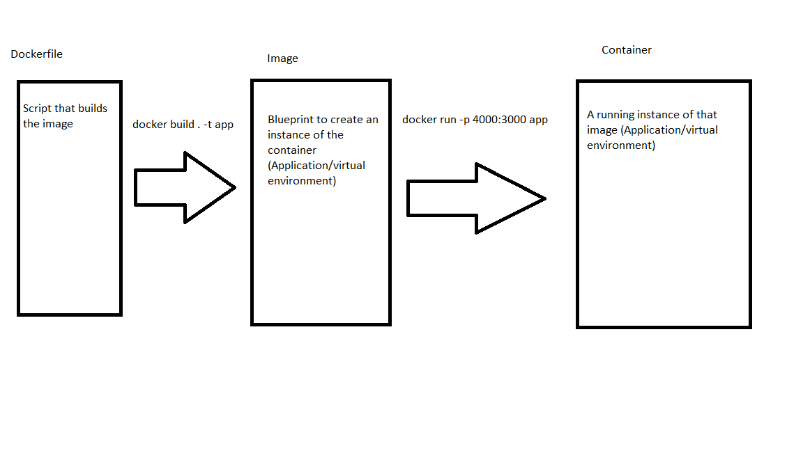

# Week 8 Review

# Microservices
- Pioneered by Netflix
- Development paradigm of splitting the backend into many smaller services/servers
- These servers are often responsible for a single small part of the application
    - REST API for a specific resource
    - Server that provides that authentication
    - Service that uploads photos
- Creates an ecosystem of APIs 
- Pros
    - Small applications are easier to write
    - A backend could be written in many different languages
    - You scale services individually in the cloud for max effiency
    - A single service failing does not mean the entire backend crashes
    - Makes your backend APIs more modular and easy to expand on
- Cons
    - **Discovery Problem**
        - tons of softare out there to try and solve the problem
            - Zuul
            - Zookeep
            - Ribbon
        - How do know the endpoints and IP addresses of all these APIs
            - IP addresses in the cloud are often ephemeral
                - updated and deleted often
        - Solutions
            - Registry Services
                - When a service comes online it logs itself in a registry 
                - You check the registry to find the service
                    - Can be done manualy or programmatically
    - Add more latency
        - A lot more HTTP requests
    - More configuration from developers
            

## Monolith
- In a monolith architecture all the backend for an applicaiton is in single program
    - Could be a large Java application
    - Could be a larg Node applicaiton
- Benefits
    - Some applications are easier to design when they are all one program
        - Maybe they have to ue the same local files
        - The developers have a lot of expericence in that langauge or backend framework
- Drawbacks
    - Monoliths can be difficult to work on
        - The code base could be massive, hundreds of source code files
        - Intimidating to add new features or developers
    - Locks you in to particular langauge/framework for an application
    - Do not scale very well
        - Most applications have code/features that get used much more than others
            - Login vs view reimbursemts

### Microservice vs Monilith neither is inherently better

|Comparison|Monolith|Microservices|
|----------|--------|-------------|
|Setup|faster and easier| More complex setup|
|Scaling| Vertical Scaling| Horizontal Scaling|
|App size| Large| Small code size|
|Latency|  Small | HTTP everywhere increases latency|
|Cloud Focus| Originate from on premise(often in the cloud now)| Shine in cloud environments|


# Docker
- The problem 
    - ***Well it works on my machine***
    - Deploying back-ends/applications is difficult
        - Applications have a lot of requirements to run
            - Specific environment variables
            - Specific file structure for your app to use
            - Specific runtime
                - node.js
                    - maybe node 14 not node 6
                - python
            - Computers have different operating systems
            - Starting an app require knowledge of the application
                - node npm start or ts-node or 
                - python3 py
                - ruby
                - Execute the command in the correct directory
            - You have to know what port your application is listening on 
- Solutions
    - deal with it
        - Makes deployment difficult
        - you get a virtual machine spend hours configuring it
    - Serverless options
        - All serverless options have their own learning curve
            - constantly forgetting GCP vs Azure vs AWS configurations and UI
        - Serverless options give you less control of the application
            - Might have to have a specific file structure
            - Run a specific runtime
    - **Containerize** The docker solution
        - Build a virtual environment for your application
        - Ship your application in a virtual environment
- Docker
    - Is **containerization software**
    - Put applications into easily distrubutable formats
- Docker Circle of life
    1. **Dockerfile**
        - A script that will generate an image
    2. **Image**
        - A blue print for a container
        - Class
    3. **Container**
        - Instance of an image
        - Object
- Dockerhub
    - Github for Docker images
    - You can find an image of almost anything on Dockerhub

```bash
docker build . -t greeting-app
# docker build dirctoryofdockerfile -tag nameofimage

docker run -p 4000:3000 greeting-app
# docker run -port outsideport:containerport image
# Create a runnning instance of the image AKA a container

docker kill 17108hdje # container id

docker ps # view all running containers

```
## Container vs VM
- VM Virtual Machine
    - A heavyweight virtualization option
    - It has its own Operating System
    - Has its own memory CPU and hard drive
    - **Azure Virtual Machine**
- Container 
    - Lightweight virtualization
    - They run on top of an Operating system
        - Usually linux for docker
    - They are just a linux process
    - More like a **running application** on a machine
        - Having excel open
        - Having a desktop app running


### Best practicies for containers
- usually a container should have only 1 running application inside of it
- Containers are good for *stateless* applications
    - Containers ephemeral 
        - Any data inside a container is lost forever when killed
    - You can persist data if you use a volume and mount it to the container
        - A diskspace allocated to a container

### Kubernetes K8s
- Container Orchestration Managment Software
    - Allows you to run dozens to thousands of containers with dynamic auto-scaling and rounting
    - Runs of a cluster of vms
- Docker Swarm is an alternative to K8s (Not as popular), less advanced but easier


### Azure Resources 
- **Azure Container instances**
    - Resource for deploying containers
    - Uses a shared pool of RAM and CPU to run your containers
- **Azure Active Directory**
    - Authentication is hard
    - Creating users and getting users logged in is very common for web apps
        - The process to be secure
    - People often forget their username or password
    - One user usually uses multiple web apps
        - You want to keep track of them
        - You only want certain people to be able to login or have certain permissions
    - Outsource authentication to Microsoft
        - **Tenants**
            - Phonebooks of users
        - **User**
            - A uniquely identifiable person
        - **redirectURI**
            - the route that **MSAL** Microsoft Authentication library will redirect after login
            - make sure the URI is whitelisted in Active Directory
    - You can NEVER put sensitive information in a frontend
- **API Management**
    - API management tool
    - A wrapper around any of our deplpyed APIS
        - Give a uniform domain name
        - Authentication
        - Editing requests and responses before getting to the server 
        - Validate JSONs
        - etc...
    - How it applies to microservices
        - Makes much easier to uninfy and standardized the many APIS     